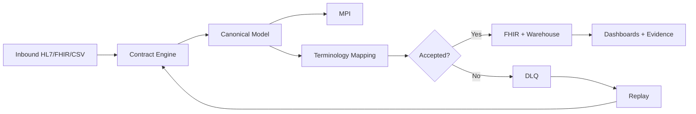

# Architecture

```mermaid
flowchart LR
  A[Inbound HL7/FHIR/CSV] --> B[Contract Engine]
  B --> C[Canonical Model]
  C --> D[MPI]
  C --> E[Terminology Mapping]
  E --> F{Accepted?}
  F -->|Yes| G[FHIR + Warehouse]
  F -->|No| H[DLQ]
  H --> I[Replay]
  I --> B
  G --> J[Dashboards + Evidence]
```

Core principle: every artifact attaches to `run_id`.
